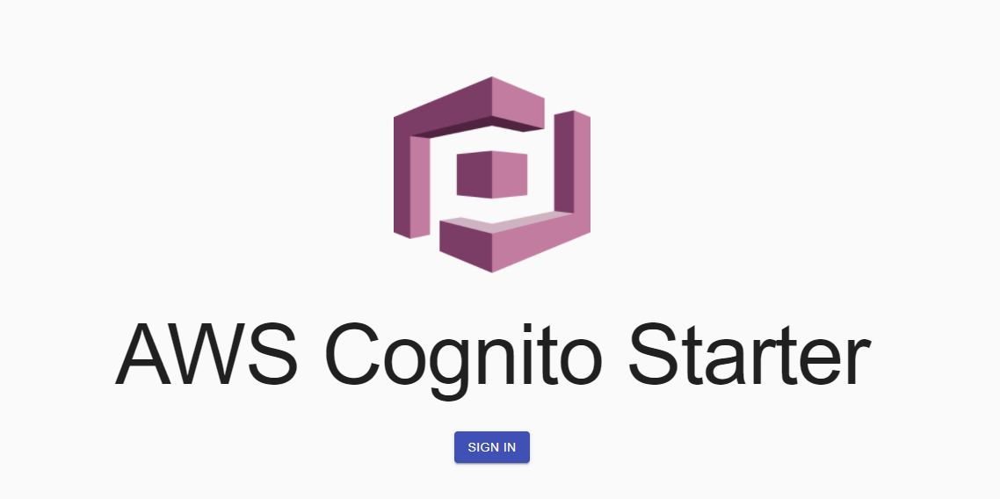

# aws-cognito-react - v2



If you are looking for v1 version it can be found on the legacy branch. With the release of v2, v1 is no longer supported

Reference implementation / boilerplate for AWS Cognito user management

## Demo

[aws-cognito-react-demo](http://aws-cognito-react.s3-website-us-west-2.amazonaws.com/)

## v2 Changes

- Switched to Typescript
- Replaced redux and saga's with react context
- Upgraded all libraries to latest major versions
- No security scan issues
- Hooks used to manage states
- Updated to Material UI 4x
- Added AWS CDK to manage infrastructure
- Cleaner and simpler Architecture
- Responsive design

## AWS Cognito Infrastructure setup

To help deploy the AWS Cognito infrastructure I've create an Amazon Cloud Development (CDK) script

CDK set up instructions can be found [here](https://docs.aws.amazon.com/cdk/latest/guide/cli.html)

CDK deploy instructions

```bash
cd cdk
npm run cdk bootstrap   # only needed first time
npm run cdk deploy
```

After deployment copy the userPoolId and userPoolClientId values from the command line window; you will need these values in the app config step

## App Configuration

Setup the Cognito environment values buy creating app/.env.local file and adding the following

```bash
REACT_APP_USERPOOL_ID=YOUR_USER_POOL_ID
REACT_APP_CLIENT_ID=YOUR_CLIENT_ID
```

Create React App has been used to setup the development process so the next steps should be familiar

```bash
cd app
npm install
npm start
```

## Other Solutions

[Firebase Auth](https://firebase.google.com/products/auth?gclid=Cj0KCQiAtqL-BRC0ARIsAF4K3WFgWD7NC4y4eJfdGZg68t4ovEoqpGrqWWk2kj1_htu5e2844DCBKVoaAhl_EALw_wcB) - Great for mobile and web. Fairly limited but easy to use. Integrates really nicely with other Firebase services

[Auth0](https://auth0.com/) - Comes with comprehensive and feature rich frontend. Seems to quicky get expensive but a very safe option

[Keycloak](https://www.keycloak.org/) - Excellent feature rich Enterprise service that offers fully themable frontend. No Cloud solution but easy to deploy to AWS using [this](https://github.com/dbroadhurst/aws-cdk-fargate-keycloak) CDK script

## Useful References

<https://www.npmjs.com/package/amazon-cognito-identity-js>

<https://docs.aws.amazon.com/cdk/api/latest/docs/aws-cognito-readme.html>

<https://docs.aws.amazon.com/cognito/latest/developerguide/cognito-user-pools-social-idp.html>

<https://docs.aws.amazon.com/cdk/latest/guide/getting_started.html>
